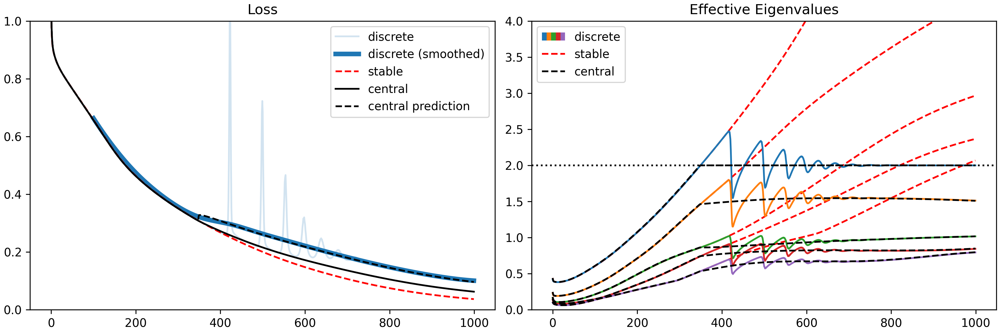

A JAX implementation of [centralflows.github.io](https://centralflows.github.io). You can either install it by cloning the repository and running `pip install -e .` or by running `pip install git+https://github.com/alex-damian/central_flows_jax`.

See [examples/mlp.ipynb](examples/mlp.ipynb) for a minimal example. It generates this plot in approximately 1 minute on a CPU:

